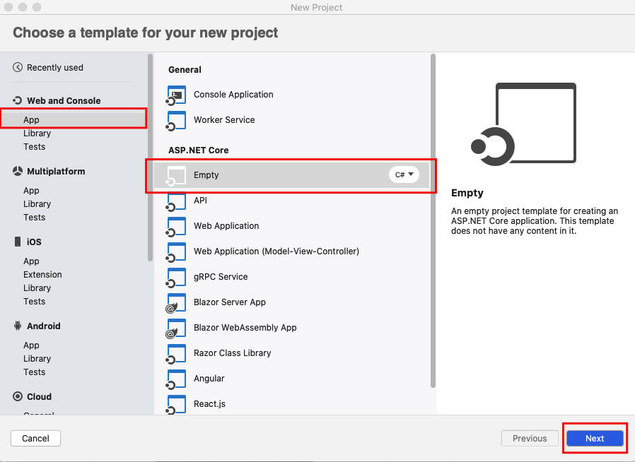
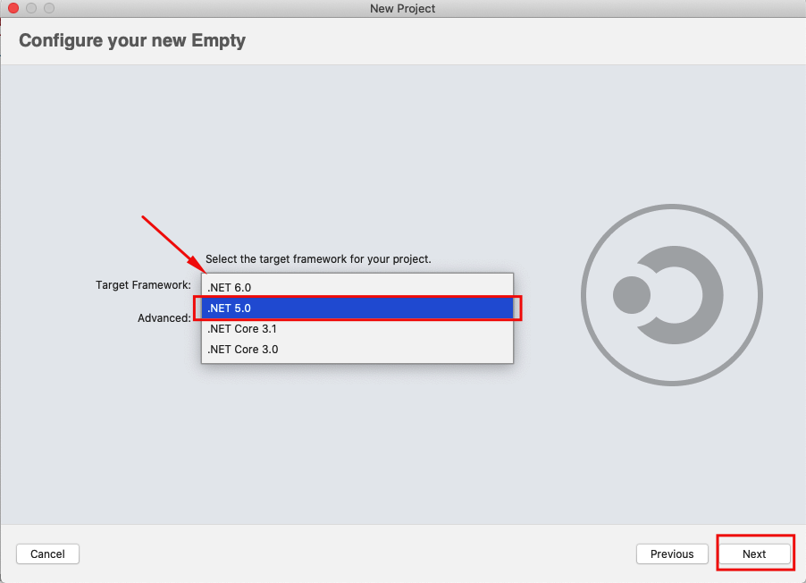
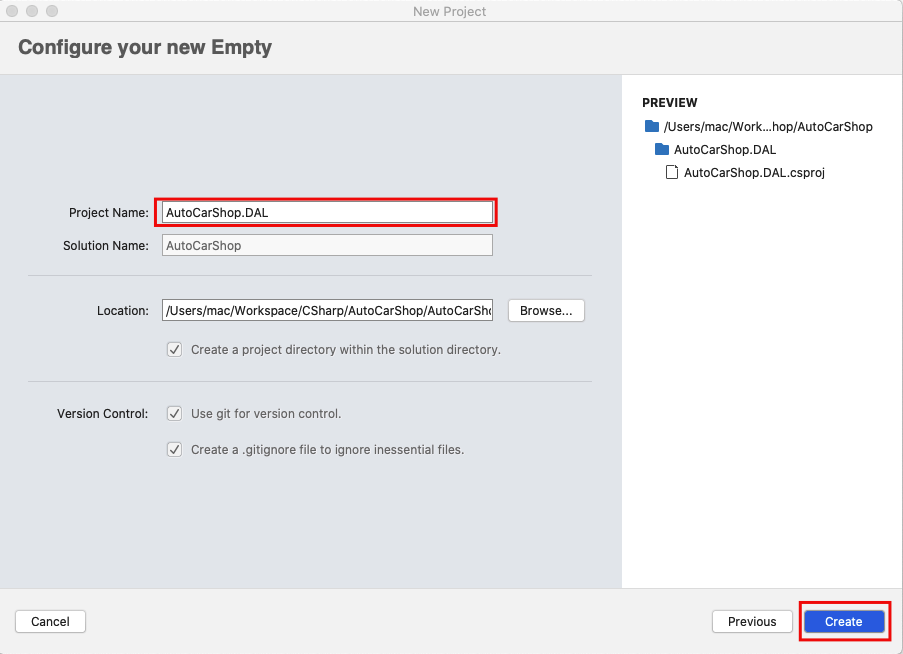
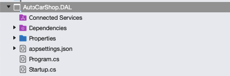
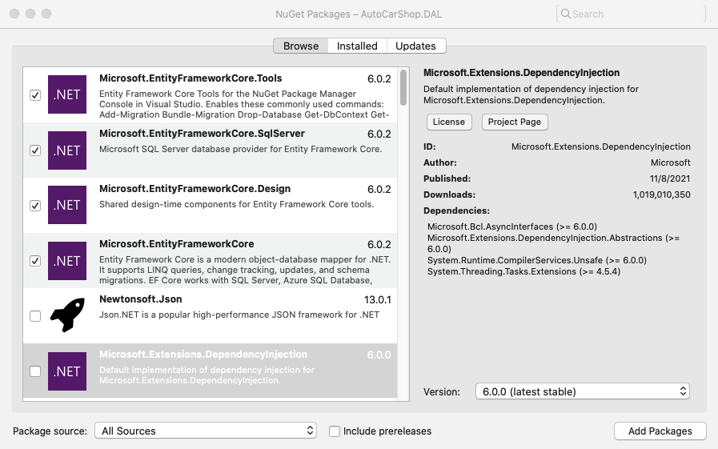
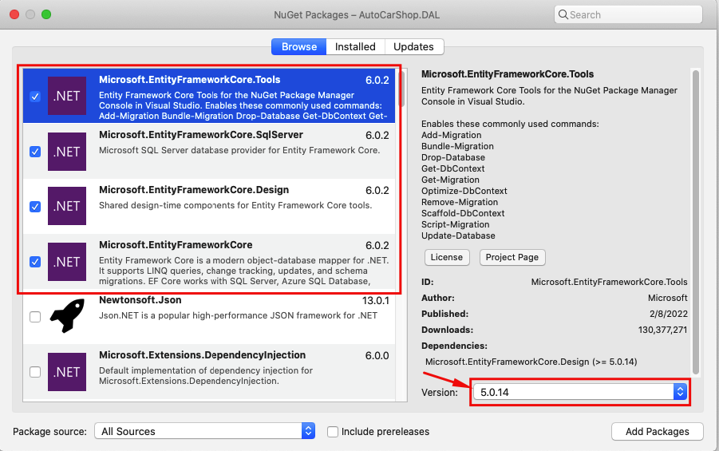
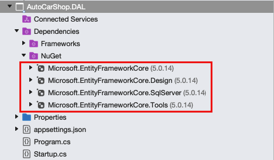
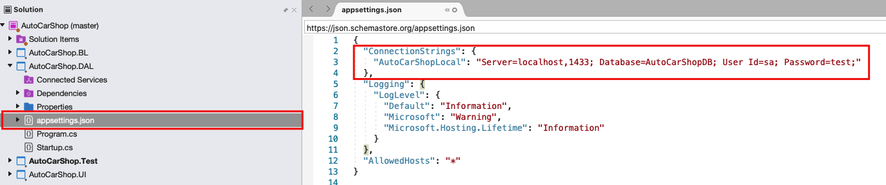
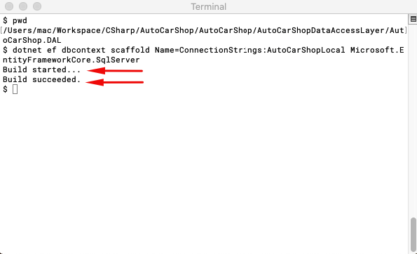
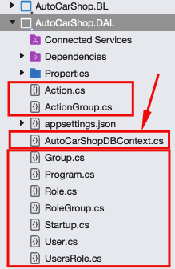

# Ingeniería inversa con .NET Core 5 en Visual Studio 2019 Versión comunidad para Mac

## !Vamos allá¡

### ¿Que necesitas?

* Herramientas [PMC](https://docs.microsoft.com/en-us/ef/core/cli/powershell) o Herramientas [CLI](https://docs.microsoft.com/en-us/ef/core/cli/dotnet)
* Paquete de NuGet ```Microsoft.EntityFramework.Design``` instalado en el proyecto donde deseas crear los andamios de tu proyecto, es decir las clases basado en una base de datos existente.
* Tambien necesitaras un [proveedor de base de datos](https://docs.microsoft.com/en-us/ef/core/providers/?tabs=dotnet-core-cli) para el esquema hacia el cual vas a realizar la ingeniería inversa.

Así como indica la documentación oficial de Microsoft sobre hacer ingeniería inversa, existen dos formas para realizar esta acción,
la primera es usando el comando Scaffold-DbContext desde la consola usando el paquete de herramientas (EF Core Package Manager Console (PMC)) o utilizando
el comando dotnet ef db context scaffold desde la interfaz de consola de .NET (.NET Command-Line Interface(CLI) Tools).

Desde aquí en adelante nos enfocaremos en que seguir una secuenta de pasos asumiendo
que utilizas las siguientes herramientas:

* [Docker](https://docs.docker.com/desktop/mac/install/) desktop comunidad para Mac (2.2.0.3(42716))
* Imagen de docker de [Sql Server 2019](https://hub.docker.com/_/microsoft-mssql-server)
* [Visual Studio para Mac](https://visualstudio.microsoft.com/es/vs/mac/) Comunidad (8.10.10(build 8))
* .NET 5
* Microsoft.EntityFrameworkCore (5.0.14)
* Microsoft.EntityFrameworkCore.Design (5.0.14)
* Microsoft.EntityFrameworkCore.SqlServer (5.0.14)
* Microsoft.EntityFrameworkCore.Tools (5.0.14)

## Paso uno

Crear proyecto vacío tipo .NET Core

Crear proyecto de .NET Core en blanco para que nos cree una esctructura básica solo con lo necesario.


Clic en siguiente (Next).

## Paso dos

Selecionar la versión de .NET Core deseada en nuestro caso será .NET 5.0

Clic en siguiente (Next).

## Paso tres

Elegir un nombre y ubicación para nuestro proyecto

Clic en Crear (Create).

Si todo va bien debemos de tener el siguiente proyecto



## Paso cuatro

Instalar los paquetes desde NuGet





**Nota: todos los paquetes deben de ser instalados con la versión 5.0.14.**

### Si haz modificado anteriormente los archivos .csproj, puedes copiar la siguiente sección y evitar seleccionarlos uno a uno

``` xml
  <ItemGroup>
    <PackageReference Include="Microsoft.EntityFrameworkCore" Version="5.0.14" />
    <PackageReference Include="Microsoft.EntityFrameworkCore.Design" Version="5.0.14">
      <IncludeAssets>runtime; build; native; contentfiles; analyzers; buildtransitive</IncludeAssets>
      <PrivateAssets>all</PrivateAssets>
    </PackageReference>
    <PackageReference Include="Microsoft.EntityFrameworkCore.SqlServer" Version="5.0.14" />
    <PackageReference Include="Microsoft.EntityFrameworkCore.Tools" Version="5.0.14">
      <IncludeAssets>runtime; build; native; contentfiles; analyzers; buildtransitive</IncludeAssets>
      <PrivateAssets>all</PrivateAssets>
    </PackageReference>
  </ItemGroup>
```

Luego de instalar todos los paquetes deberiamos de tener lo siguiente en nuestro proyecto.



## Paso cinco

Configurar la cadena de conexión en el archivo appsettings.json

``` json
 "ConnectionStrings": {
    "AutoCarShopLocal": "Server=localhost,1433; Database=AutoCarShopDB; User Id=sa; Password=test;"
  },
```



## Paso 6

Ejecutando comando en consola.

*En este punto asumiremos que has desidido instalar como parte de los prerequisitos las Herramientas CLI.*

Procedemos a hacer clic derecho en nuestro projecto **AutoCarShop.DAL > Tools > Open in Terminal** esto abrira una consola directamente en la ruta de este proyecto.

En este punto si hemos configurado todo correctamente podemos ejecutar el siguiente comando:

``` dotnet
dotnet ef dbcontext scaffold Name=ConnectionStrings:AutoCarShopLocal Microsoft.EntityFrameworkCore.SqlServer 
```



En nuestro proyecto veremos los siguientes archivos generados:


!Listo¡, con esto hemos completado cada paso, ahora podemos continar realizar configuraciones mas avanzadas.


Si deseas ver ejemplos mas generales puedes verificar la documetación oficial de [Microsoft](https://docs.microsoft.com/en-us/ef/core/managing-schemas/scaffolding?tabs=dotnet-core-cli).
